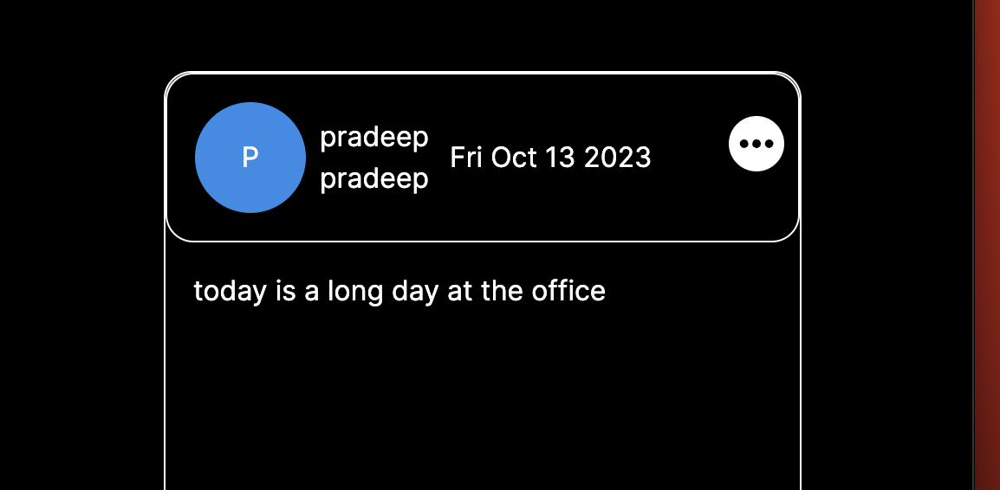
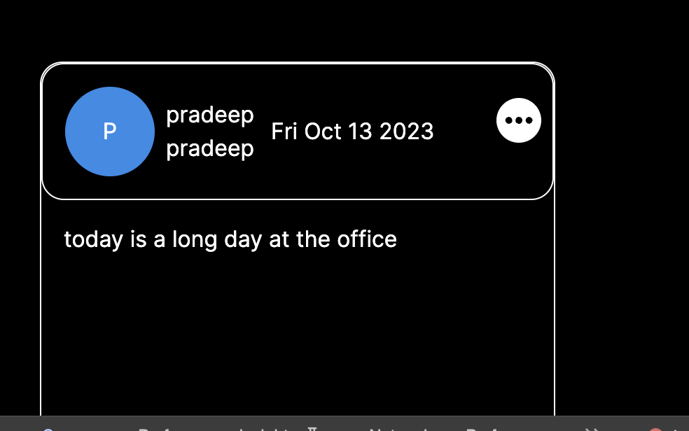
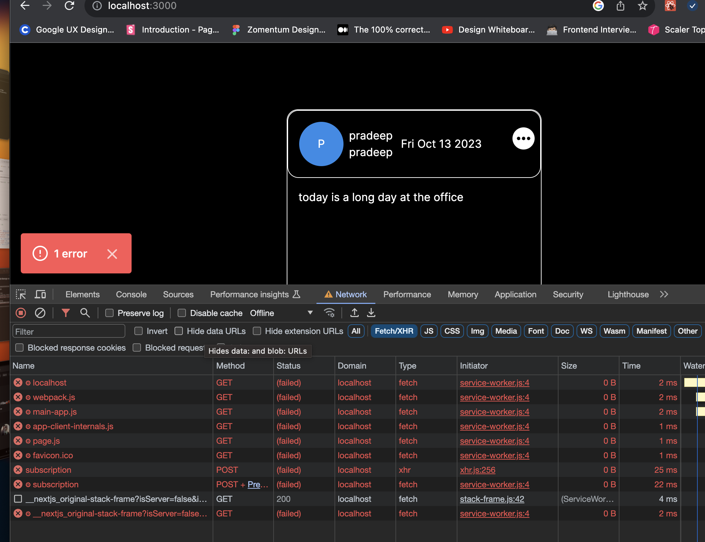
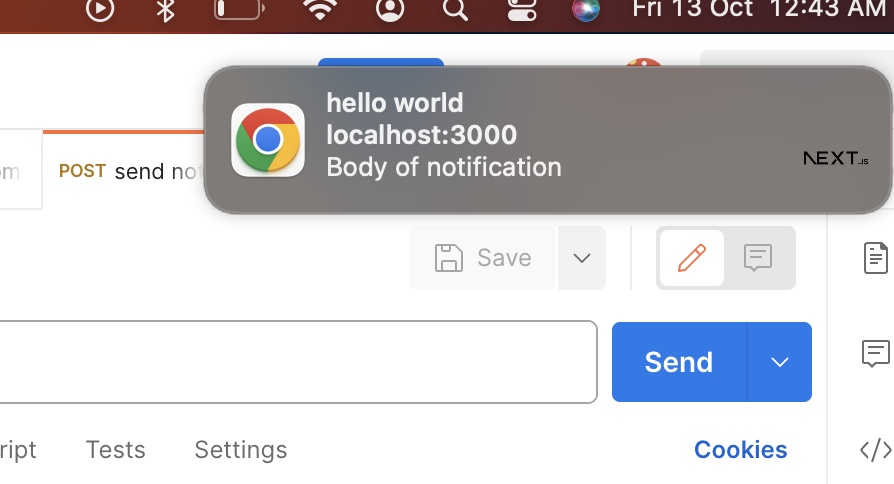

This is a [Next.js](https://nextjs.org/) project bootstrapped with [`create-next-app`](https://github.com/vercel/next.js/tree/canary/packages/create-next-app).

## Getting Started

First, run the development server:

```bash
npm run dev
# or
yarn dev
# or
pnpm dev
```

Open [http://localhost:3000](http://localhost:3000) with your browser to see the result.
This is a Practice project where I practice Frontend concepts

The Frontend is tightly coupled with the Backend in all services (push notifications, websocket)

1. Responsive design




2. offline support using service workers



3. push notification with actions using service worker and pushManager



UpComing:

1. Speech Synthesiser
2. Installable PWA
3. Chat applications (web sockets have been implemented need to implement Chat UI)
